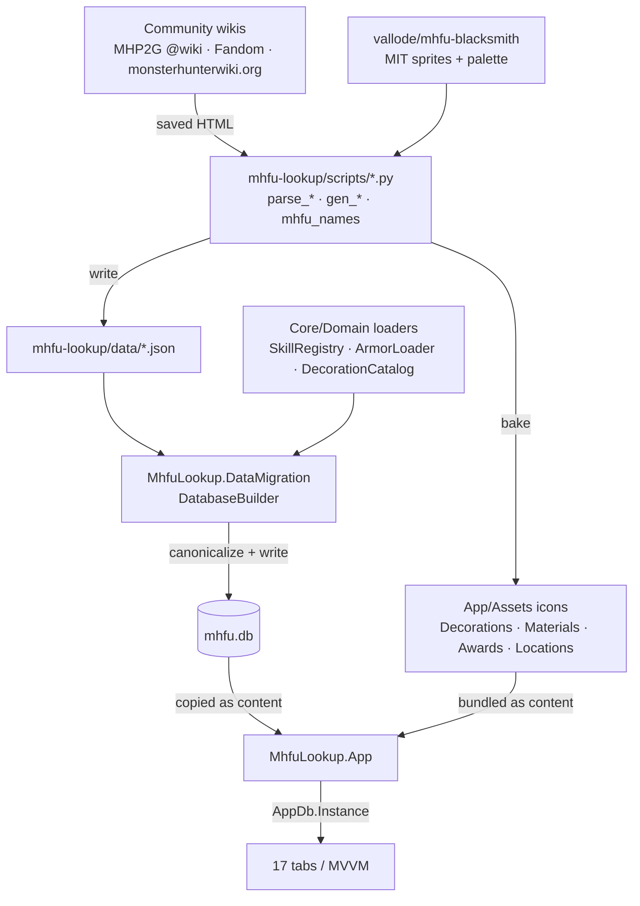

# Architecture & Data Flow

## The four projects

The solution (`MhfuLookup.slnx`) has four projects:

| Project | Type | Target | Purpose |
|---|---|---|---|
| [`MhfuLookup.Core`](../src/MhfuLookup.Core) | class library | `net8.0` | Domain models, the ported game logic (`Domain/`), the SQLite schema + a read/write facade over `mhfu.db` (`Data/`). |
| [`MhfuLookup.App`](../src/MhfuLookup.App) | WinUI 3 | `net8.0-windows10.0.19041.0` | The desktop UI — MVVM, one page per tab. References Core. |
| [`MhfuLookup.DataMigration`](../src/MhfuLookup.DataMigration) | console | `net8.0` | One-shot builder that reads the JSON data tree and writes `mhfu.db`. References Core. |
| [`MhfuLookup.Core.Tests`](../tests/MhfuLookup.Core.Tests) | xUnit | `net8.0` | Parity tests for the domain logic (ported from the Python `pytest` suite). |

Dependencies flow one way: **App → Core** and **DataMigration → Core**. The App never reads JSON; it
only reads `mhfu.db`.

## Data flow

The Python project (`../../mhfu-lookup`) remains the **source of truth for the data**. Raw community-wiki
content is parsed into JSON by Python scripts; the C# migration tool canonicalizes that JSON into a single
SQLite database the app ships with.



Two stages worth separating:

1. **Python → JSON + assets** (`mhfu-lookup/scripts/`, run by hand when a source changes). See
   [app-structure.md](app-structure.md#data-pipeline-scripts) for what each script does. The shared
   `mhfu_names.py` reconciles wiki spellings with in-game names so display and icon resolution stay
   consistent.
2. **JSON → `mhfu.db`** (`MhfuLookup.DataMigration`). `DatabaseBuilder` reuses the Core domain loaders so
   the DB stores *clean, canonical* data — e.g. armor is flattened to one row per (set × class × slot)
   with class-split material fallback, and every skill reference is resolved to its canonical id.

## Build & run

```powershell
# 1. (Re)build the database from the Python data tree — run once, or after data changes.
dotnet run --project src/MhfuLookup.DataMigration -c Debug

# 2. Build / run the app.
dotnet build src/MhfuLookup.App/MhfuLookup.App.csproj -r win-x64
dotnet run   --project src/MhfuLookup.App

# 3. Tests.
dotnet test tests/MhfuLookup.Core.Tests/MhfuLookup.Core.Tests.csproj
```

The migration tool defaults work with no arguments: it walks up from its output directory to find
`mhfu-lookup/data` (anchored on `v2/armor_skills_v2.json`) and writes to `MHFU_DB/data/mhfu.db`. Override
with `dotnet run --project src/MhfuLookup.DataMigration -- <dataDir> <outputDbPath>`. After building, it
**validates row counts** (e.g. decorations = 168, armor_pieces = 1900, quest_categories = 5) and throws if
they don't match — a cheap guard against a broken parse.

## Where `mhfu.db` lives

- **Dev:** `MHFU_DB/data/mhfu.db` (written by the migration tool; checked for via `Locator.FindSolutionDir`).
- **Runtime:** shipped as **content** next to the app and resolved through
  [`Services/AppDb.cs`](../src/MhfuLookup.App/Services/AppDb.cs), which checks `AppContext.BaseDirectory`
  first and falls back to the dev `data/` folder. One long-lived connection serves the whole (single-user)
  app.

## Why a hybrid SQLite schema

Reference data splits in two:

- **Things you filter / join / aggregate on** (skills, decorations, armor pieces, weapons, items…) are
  **normalized** into typed columns + indexes.
- **Deeply-nested, irregular documents** (a monster's hitzones/ailments/loot tables, a quest category, a
  gathering area, a weapon's type-specific stats) are kept whole in a **`doc_json` TEXT column** and
  rehydrated in C#.

This avoids both extremes — no sprawling EAV tables for the irregular stuff, and no slow full-document
scans for the queryable stuff. Details in [database-schema.md](database-schema.md).
